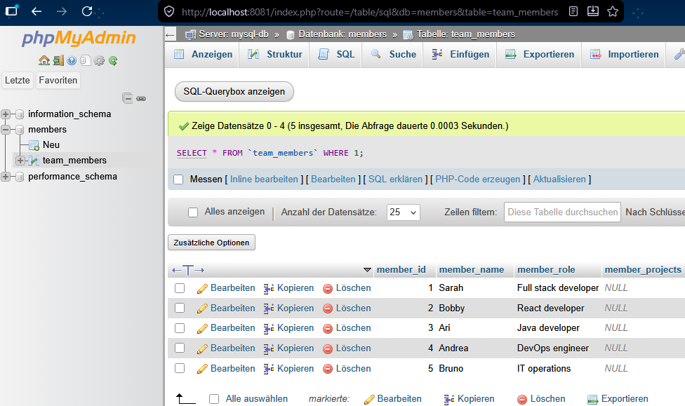
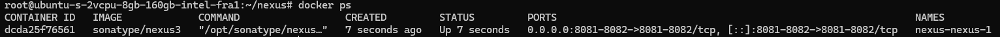
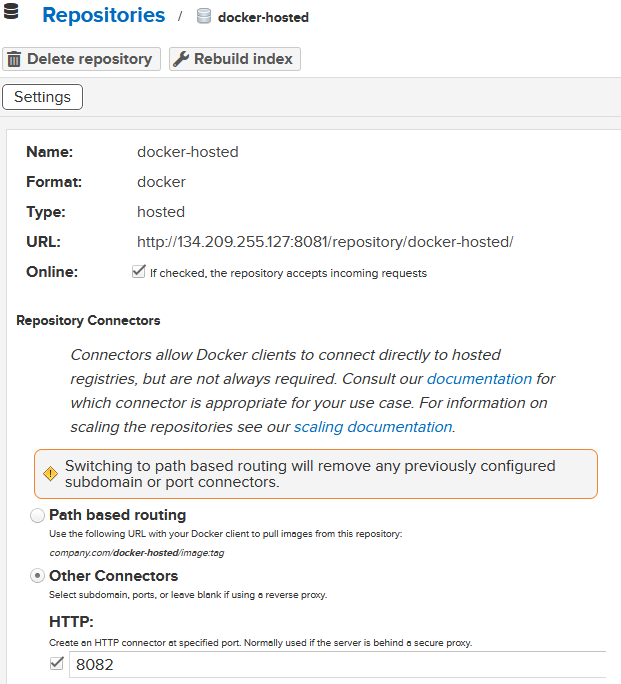
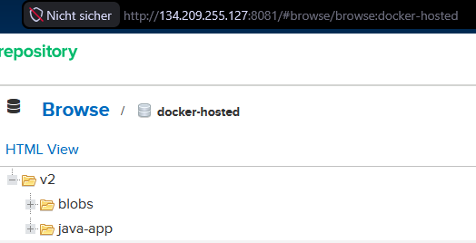
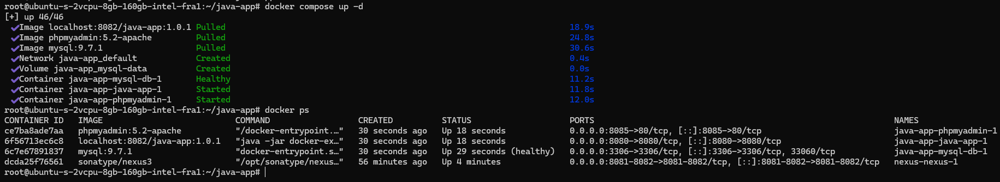
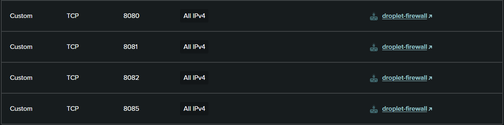

# EXERCISE 07

## 📖 7 - Containers with Docker
Your team member has improved your previous static java application and added mysql database connection, to let users edit information and save the edited data.
They ask you to configure and run the application with Mysql database on a server using docker-compose.


### <ins>EXERCISE 1: Start Mysql container</ins>
First you want to test the application locally with a mysql database. But you don't want to install Mysql, you want to get started fast, so you start it as a docker container:
- Start mysql container locally using the official Docker image. Set all needed environment variables.
- Export all needed environment variables for your application for connecting with the database (check variable names inside the code).
- Build a jar file and start the application. Test access from browser. Make some changes.

### Solution 1
Start the database container:
```cmd
docker run -d --rm \
  --name mysql-db \
  -e MYSQL_ROOT_PASSWORD=password \
  -e MYSQL_USER=app \
  -e MYSQL_PASSWORD=passwd123! \
  -e MYSQL_DATABASE=members \
  -p 3306:3306 \
  mysql:9.7.1
```

Set the environment variables on Windows:
```cmd
set DB_SERVER=localhost
set DB_USER=app
set DB_PWD=passwd123!
set DB_NAME=members
```

Build and start the app:
```cmd
gradle build
java -jar build\libs\docker-exercises-project-1.0-SNAPSHOT.jar
```

### <ins>EXERCISE 2: Start Mysql GUI container</ins>
Now you have a database, you want to be able to see the database data using a UI tool, so you decide to deploy phpmyadmin. Again, you don't want to install it locally, so you want to start it also as a docker container.
- Start phpmyadmin container using the official image.
- Access phpmyadmin from your browser and test logging in to your Mysql database.

### Solution 2
Create a network:
```cmd
docker network create sqlnet
```

Restart the mysql docker container with the argument `--network sqlnet`.

Start run phpmyadmin:
```cmd
docker run -d --rm --name phpmyadmin --network sqlnet -e PMA_HOST=mysql-db -p 8081:80 phpmyadmin
```

Then, at http://localhost:8081 I can login with app:passwd123!. The team members where successfully added to the members db:



### <ins>EXERCISE 3: Use docker-compose for Mysql and Phpmyadmin</ins>
You have 2 containers your app needs and you don't want to start them separately all the time. So you configure a docker-compose file for both:
- Create a docker-compose file with both containers.
- Configure a volume for your DB.
- Test that everything works again.

### Solution 3
The services defined in **_docker-compose.yaml_** are started with
```cmd
docker compose up -d
```

### <ins>EXERCISE 4: Dockerize your Java Application</ins>
Now you are done with testing the application locally with Mysql database and want to deploy it on the server to make it accessible for others in the team, so they can edit information.
And since your DB and DB UI are running as docker containers, you want to make your app also run as a docker container. So you can all start them using 1 docker-compose file on the server. So you do the following:
- Create a Dockerfile for your java application.

### Solution 4

The **_Dockerfile_**:
```Dockerfile
# Use the java version installed locally for the bootcamp
# NOTE: The alpine image is small since it comes with a minimal toolkit to run java apps
FROM amazoncorretto:17-alpine-jdk

# Expose the port to which the app publishes its http content
EXPOSE 8080

# Create a directory to copy the built artifact to
RUN mkdir /app
WORKDIR /app

# Copy the artifact into the app
COPY build/libs/docker-exercises-project-1.0-SNAPSHOT.jar .

# Run the app on starting the container
CMD ["java", "-jar", "docker-exercises-project-1.0-SNAPSHOT.jar"]
```


The build command:
```cmd
docker build -t java-app:1.0.1 .
```

### <ins>EXERCISE 5: Build and push Java Application Docker Image</ins>
Now for you to be able to run your java app as a docker image on a remote server, it must be first hosted on a docker repository, so you can fetch it from there on the server. Therefore, you have to do the following:
- Create a docker hosted repository on Nexus.
- Build the image locally and push to this repository.

### Solution 5
> **Note:** A droplet that was arleady created during the lecture was used here. To access it via the browser the firewall as to be adjusted to allow inbound connections on port 8081.

Nexus is started on the server with `docker compose up -d` using the following **_docker-compose.yaml_**:
```yaml
services:
  nexus:
    image: sonatype/nexus3
    ports:
      - 8081:8081  # For web UI and REST API
      - 8082:8082  # End point for docker cli
    volumes:
      - nexus-data:/nexus-data
volumes:
  nexus-data:
    driver: local
```



As an admin on Nexus3:
1. A new docker-hosted repository was created. Note that for docker an extra connector is necessary to connect with docker cli.
   


3. A new role was created that is able to access the repo.
4. A new user with that role was created.

Back on by dev computer:
1. Docker prevents http connections (without ssl certificate) by default. Adapt the daemon.json to let the docker cli connect to my http server:
  ```json
  {
    "insecure-registries": [ "134.209.255.127:8082" ]
  }
  ```
2. Now I can login to the repo with `docker login`, which requires me to enter the credentials of the Nexus3 user which was just created in the Nexus UI:
   ```cmd
   docker login 134.209.255.127:8082
   ```
3. Tag the built jar file to incorporate the repo url in the image name:
   ```cmd
   docker tag java-app:1.0.1 134.209.255.127:8082/java-app:1.0.1
   ```
4. Now the image can be pushed to the Nexus repository:
   ```cmd
   docker push 134.209.255.127:8082/java-app:1.0.1
   ```



### <ins>EXERCISE 6: Add application to docker-compose</ins>
Add your application's docker image to docker-compose. Configure all needed env vars.
> **Hint:** Ensure you configure a health check on your mysql container by including the following in your docker-compose file:

```yaml
my-java-app:
  depends_on:
    mysql:
      condition: service_healthy
mysql:
  healthcheck:
    test: [ "CMD", "mysqladmin", "ping", "-h", "localhost" ]
    interval: 10s
    timeout: 5s
    retries: 5
```

Now your app and Mysql containers in your docker-compose are using environment variables.
- Make all these environment variable values configurable, by setting them on the server when deploying.

> **Info:** Again, since docker-compose is part of your application and checked in to the repo, it shouldn't contain any sensitive data. But also allow configuring these values from outside based on an environment

### Solution 6
1. Export variables in **_~/.bashrc_** file:
   ```bash
   export DB_ROOT_PW=password
   export DB_USER=app
   export DB_PWD=passwd123!
   export DB_NAME=members
   export DB_SERVER=mysql-db
   ```
2. Activate the changes with `source .bashrc`.
3. In the **_docker-compose.yaml_** use the variables in the format `MYSQL_USER=${DB_USER}`. 
4. Also on the server insecure registries have to be allowed. For that adjust the **_daemon.json_** file as done in [exercise 5](#solution-5) on the dev computer.
   > **Note:** Since I installed docker on the server using snap that file is located at **_/var/snap/docker/current/config/daemon.json_**.
5. Then, login with `docker login 134.209.255.127:8082` and the credentials of the user created on Nexus3.
6. Finally run the services after copying the compose file to the server with `docker compose up -d`.
> **Note:** Since Nexus itself is already running on port 8081 phpmyadmin has to be moved to port 8085.

Now all services are online:


### <ins>EXERCISE 7: Run application on server with docker-compose</ins>
Finally your docker-compose file is completed and you want to run your application on the server with docker-compose. For that you need to do the following:

- Set insecure docker repository on server, because Nexus uses http.
- Run docker login on the server to be allowed to pull the image.
- Your application index.html has a hardcoded localhost as a HOST to send requests to the backend. You need to fix that and set the server IP address instead, because the server is going to be the host when you deploy the application on a remote server. (Don't forget to rebuild and push the image and if needed adjust the docker-compose file).
- Copy docker-compose.yaml to the server.
- Set the needed environment variables for all containers in docker-compose.
- Run docker-compose to start all 3 containers.

### Solution 7
The docker login part was already done in [exercise 5](#solution-5).
The HOST variable in the **_index.html_** was changed to the server IP:
```js
const HOST = "134.209.255.127";
```

Then the app and the docker image were rebuilt and pushed to Nexus:
```cmd
gradle clean
gradle build
docker build -t 134.209.255.127:8082/java-app:1.0.2 .
docker push  134.209.255.127:8082/java-app:1.0.2
```


### <ins>EXERCISE 8: Open ports</ins>
Congratulations! Your application is running on the server, but you still can't access the application from the browser. You know you need to configure firewall settings. So do the following:
- Open the necessary port on the server firewall and
- test access from the browser.

### Solution 8
Already done in [exercise 5](#solution-5).
The open ports are:
1. 8080 → to access the java-app
2. 8081 → Nexus3 web app and REST API
3. 8082 → Nexus3 endpoint for docker cli
4. 8085 → phpmyadmin

> **PhpMyAdmin** should not be public to the web in a real prod environment. This port is open only for education purposes.



