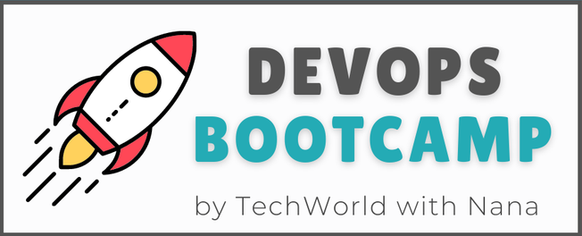

<h1>

📖 7 - Containers with Docker
</h1>

## 📋 Bootcamp Curriculum

<h3 align="center">DevOps Prerequisites</h3>

    1 - Introduction to DevOps (no repository) •
    2 - Operating Systems & Linux Basics (no repository) 
    3 - Version Control with Git (no repository) •
    <a href="https://github.com/timmartinberger/devops-bootcamp-04-build-tools">4 - Build and Package Management Tools</a>

<h3 align="center">DevOps Fundamentals</h3>

    <a href="https://github.com/timmartinberger/devops-bootcamp-05-cloud-iaas">5 - Cloud & Infrastructure as Service</a> •
    <a href="https://github.com/timmartinberger/devops-bootcamp-06-artifact-repositories">6 - Artifact Repository Manager with Nexus</a> •
    <a href="https://github.com/timmartinberger/devops-bootcamp-07-docker"><b>🔖 7 - Containers with Docker</b></a>

<h3 align="center">DevOps Core</h3>

    <a href="https://github.com/timmartinberger/devops-bootcamp-08-jenkins">8 - Build Automation & CI/CD with Jenkins</a> •
    <a href="">9 - AWS Services</a> 
    <a href="">10 - Container Orchestration with Kubernetes</a> •
    <a href="">11 - Kubernetes on AWS - EKS</a>

<h3 align="center">DevOps Advanced</h3>

    <a href="">12 - Infrastructure as Code with Terraform</a> •
    <a href="">13 - Programming Basics with Python</a> 
    <a href="">14 - Automation with Python</a> •
    <a href="">15 - Configuration Management with Ansible</a> •
    <a href="">16 - Monitoring with Prometheus</a>

---

## 🔻 Scope of this Module
- Building apps with Docker 
- Run multiservice apps consisting of a database and a web app using `docker compose`
  - Usage of volumes for persistent data
  - Environment variables to maintain database connections
- Pushing Docker images to the artifact repository Nexus3
- Run apps on the remote cloud server created at DigitalOcean

        

### Projects
#### [01-js-app](01-js-app)
A small JavaScript app that connects to a MongoDB database, whereas both the JS app and the database were containerized using Docker.
#### [02-nexus-docker](02-nexus-docker)
A **_docker-compose.yaml_** to start Nexus3 on the DigitalOcean droplet with. This docker-compose file already contains the settings for the port forwarding and the volume, so that the Nexus service can be started with the one-liner `docker compose up -d`.
#### [03-docker-exercises](03-docker-exercises)
This is a small Java app that connects to a MySQL database. Detailed information can be found in the project directory. In summary the following things were done:
- The Java app was build using Gradle.
- A remote Nexus3 server was set up on a cloud server from DigitalOcean.
- The Java app was pushed a docker repository in Nexus.
- On the remote server the app and a MySQL database were started using `docker compose`.
- Sensitive data was handled using environment variables to avoid exploitation of hard coded credentials in the source code.

### Lecture Notes
[Click here](NOTES.md).

---

## 🌟 Acknowledgement
This repository was created as part of the TechWorldWithNana DevOps Bootcamp. 
<a href="https://www.techworld-with-nana.com/devops-bootcamp">DevOps Bootcamp</a> •
<a href="https://www.youtube.com/@TechWorldwithNana"> TechWorld with Nana</a>
